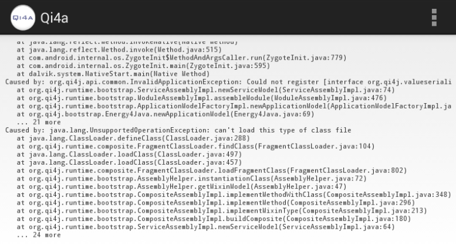

# Sample Android Application using Qi4j

**WARNING**
Qi4j do not support Android yet.
This sample Application simply demonstrate how it fails, log and display the stacktrace.
It is meant to be used by Qi4j contributors to start working on the Android support.

See the Jira issue [QI-348](https://ops4j1.jira.com/browse/QI-348)

## Peculiarities

- Use Gradle as a build system
- Can easily be imported into Android Studio
- Use Java 7 source level and by so target Android 4.4 (API 19).
- Depend on Qi4j *zero* version (`0`) from mavenLocal().
 You need to build the Qi4j SDK yourself, see the
 [Qi4j Build System tutorial](http://qi4j.org/develop/build-system.html).

## Current output

And the complete stacktrace:

    org.qi4j.bootstrap.AssemblyException: Unable to create Application Model.
            at org.qi4j.bootstrap.Energy4Java.newApplicationModel(Energy4Java.java:73)
            at org.qi4j.bootstrap.Energy4Java.newApplication(Energy4Java.java:80)
            at org.qi4j.bootstrap.SingletonAssembler.<init>(SingletonAssembler.java:52)
            at org.qi4j.android.app.MainActivity$PlaceholderFragment$1.<init>(MainActivity.java:82)
            at org.qi4j.android.app.MainActivity$PlaceholderFragment.onViewCreated(MainActivity.java:81)
            at android.app.FragmentManagerImpl.moveToState(FragmentManager.java:904)
            at android.app.FragmentManagerImpl.moveToState(FragmentManager.java:1062)
            at android.app.BackStackRecord.run(BackStackRecord.java:684)
            at android.app.FragmentManagerImpl.execPendingActions(FragmentManager.java:1447)
            at android.app.Activity.performStart(Activity.java:5240)
            at android.app.ActivityThread.performLaunchActivity(ActivityThread.java:2168)
            at android.app.ActivityThread.handleLaunchActivity(ActivityThread.java:2245)
            at android.app.ActivityThread.access$800(ActivityThread.java:135)
            at android.app.ActivityThread$H.handleMessage(ActivityThread.java:1196)
            at android.os.Handler.dispatchMessage(Handler.java:102)
            at android.os.Looper.loop(Looper.java:136)
            at android.app.ActivityThread.main(ActivityThread.java:5017)
            at java.lang.reflect.Method.invokeNative(Native Method)
            at java.lang.reflect.Method.invoke(Method.java:515)
            at com.android.internal.os.ZygoteInit$MethodAndArgsCaller.run(ZygoteInit.java:779)
            at com.android.internal.os.ZygoteInit.main(ZygoteInit.java:595)
            at dalvik.system.NativeStart.main(Native Method)
     Caused by: org.qi4j.api.common.InvalidApplicationException: Could not register [interface org.qi4j.valueserialization.jackson.JacksonValueSerializationService, interface org.qi4j.api.service.ServiceComposite]
            at org.qi4j.runtime.bootstrap.ServiceAssemblyImpl.newServiceModel(ServiceAssemblyImpl.java:74)
            at org.qi4j.runtime.bootstrap.ModuleAssemblyImpl.assembleModule(ModuleAssemblyImpl.java:476)
            at org.qi4j.runtime.bootstrap.ApplicationModelFactoryImpl.newApplicationModel(ApplicationModelFactoryImpl.java:86)
            at org.qi4j.bootstrap.Energy4Java.newApplicationModel(Energy4Java.java:69)
            at org.qi4j.bootstrap.Energy4Java.newApplication(Energy4Java.java:80)
            at org.qi4j.bootstrap.SingletonAssembler.<init>(SingletonAssembler.java:52)
            at org.qi4j.android.app.MainActivity$PlaceholderFragment$1.<init>(MainActivity.java:82)
            at org.qi4j.android.app.MainActivity$PlaceholderFragment.onViewCreated(MainActivity.java:81)
            at android.app.FragmentManagerImpl.moveToState(FragmentManager.java:904)
            at android.app.FragmentManagerImpl.moveToState(FragmentManager.java:1062)
            at android.app.BackStackRecord.run(BackStackRecord.java:684)
            at android.app.FragmentManagerImpl.execPendingActions(FragmentManager.java:1447)
            at android.app.Activity.performStart(Activity.java:5240)
            at android.app.ActivityThread.performLaunchActivity(ActivityThread.java:2168)
            at android.app.ActivityThread.handleLaunchActivity(ActivityThread.java:2245)
            at android.app.ActivityThread.access$800(ActivityThread.java:135)
            at android.app.ActivityThread$H.handleMessage(ActivityThread.java:1196)
            at android.os.Handler.dispatchMessage(Handler.java:102)
            at android.os.Looper.loop(Looper.java:136)
            at android.app.ActivityThread.main(ActivityThread.java:5017)
            at java.lang.reflect.Method.invokeNative(Native Method)
            at java.lang.reflect.Method.invoke(Method.java:515)
            at com.android.internal.os.ZygoteInit$MethodAndArgsCaller.run(ZygoteInit.java:779)
            at com.android.internal.os.ZygoteInit.main(ZygoteInit.java:595)
            at dalvik.system.NativeStart.main(Native Method)
     Caused by: java.lang.UnsupportedOperationException: can't load this type of class file
            at java.lang.ClassLoader.defineClass(ClassLoader.java:288)
            at org.qi4j.runtime.composite.FragmentClassLoader.findClass(FragmentClassLoader.java:104)
            at java.lang.ClassLoader.loadClass(ClassLoader.java:497)
            at java.lang.ClassLoader.loadClass(ClassLoader.java:457)
            at org.qi4j.runtime.composite.FragmentClassLoader.loadFragmentClass(FragmentClassLoader.java:802)
            at org.qi4j.runtime.bootstrap.AssemblyHelper.instantiationClass(AssemblyHelper.java:72)
            at org.qi4j.runtime.bootstrap.AssemblyHelper.getMixinModel(AssemblyHelper.java:47)
            at org.qi4j.runtime.bootstrap.CompositeAssemblyImpl.implementMethodWithClass(CompositeAssemblyImpl.java:348)
            at org.qi4j.runtime.bootstrap.CompositeAssemblyImpl.implementMethod(CompositeAssemblyImpl.java:296)
            at org.qi4j.runtime.bootstrap.CompositeAssemblyImpl.implementMixinType(CompositeAssemblyImpl.java:213)
            at org.qi4j.runtime.bootstrap.CompositeAssemblyImpl.buildComposite(CompositeAssemblyImpl.java:180)
            at org.qi4j.runtime.bootstrap.ServiceAssemblyImpl.newServiceModel(ServiceAssemblyImpl.java:64)
            at org.qi4j.runtime.bootstrap.ModuleAssemblyImpl.assembleModule(ModuleAssemblyImpl.java:476)
            at org.qi4j.runtime.bootstrap.ApplicationModelFactoryImpl.newApplicationModel(ApplicationModelFactoryImpl.java:86)
            at org.qi4j.bootstrap.Energy4Java.newApplicationModel(Energy4Java.java:69)
            at org.qi4j.bootstrap.Energy4Java.newApplication(Energy4Java.java:80)
            at org.qi4j.bootstrap.SingletonAssembler.<init>(SingletonAssembler.java:52)
            at org.qi4j.android.app.MainActivity$PlaceholderFragment$1.<init>(MainActivity.java:82)
            at org.qi4j.android.app.MainActivity$PlaceholderFragment.onViewCreated(MainActivity.java:81)
            at android.app.FragmentManagerImpl.moveToState(FragmentManager.java:904)
            at android.app.FragmentManagerImpl.moveToState(FragmentManager.java:1062)
            at android.app.BackStackRecord.run(BackStackRecord.java:684)
            at android.app.FragmentManagerImpl.execPendingActions(FragmentManager.java:1447)
            at android.app.Activity.performStart(Activity.java:5240)
            at android.app.ActivityThread.performLaunchActivity(ActivityThread.java:2168)
            at android.app.ActivityThread.handleLaunchActivity(ActivityThread.java:2245)
            at android.app.ActivityThread.access$800(ActivityThread.java:135)
            at android.app.ActivityThread$H.handleMessage(ActivityThread.java:1196)
            at android.os.Handler.dispatchMessage(Handler.java:102)
            at android.os.Looper.loop(Looper.java:136)
            at android.app.ActivityThread.main(ActivityThread.java:5017)
            at java.lang.reflect.Method.invokeNative(Native Method)
            at java.lang.reflect.Method.invoke(Method.java:515)
            at com.android.internal.os.ZygoteInit$MethodAndArgsCaller.run(ZygoteInit.java:779)
            at com.android.internal.os.ZygoteInit.main(ZygoteInit.java:595)
            at dalvik.system.NativeStart.main(Native Method)
